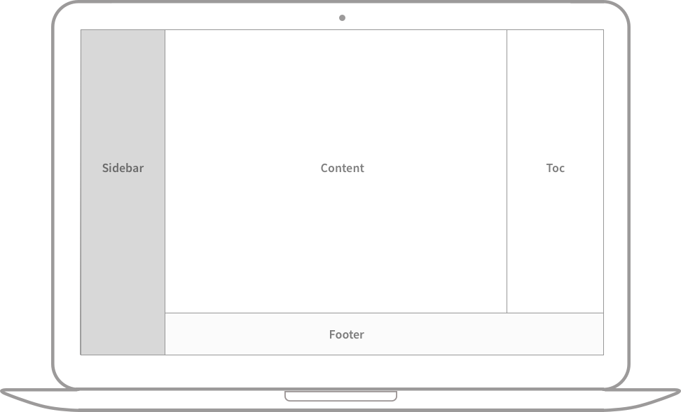
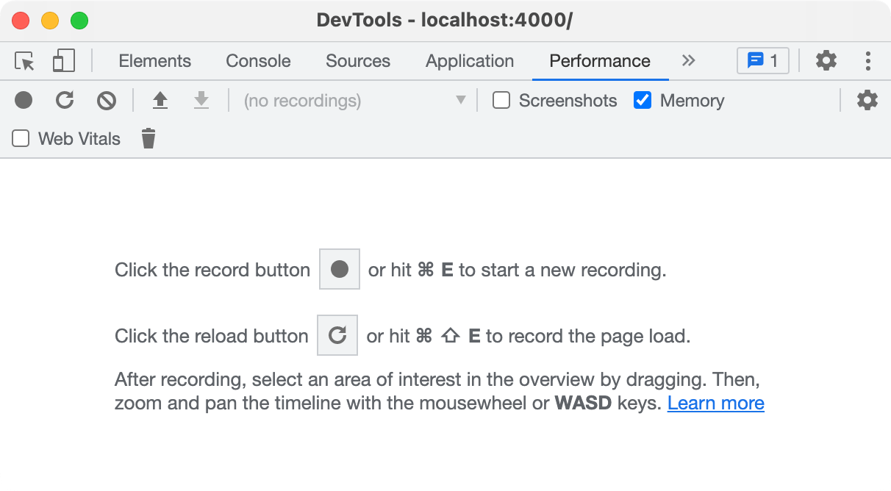

## 标题

<!-- markdownlint-capture -->
<!-- markdownlint-disable -->
# H1 — 标题 {data-toc-skip=true .mt-4 .mb-0 }

## H2 — 标题 {data-toc-skip=true .mt-4 .mb-0 }

### H3 — 标题 {data-toc-skip=true .mt-4 .mb-0 }

#### H4 — 标题 {data-toc-skip=true .mt-4 }
<!-- markdownlint-restore -->

## 段落

这是一个段落示例。在这里，我们可以看到段落是如何在 Markdown 中呈现的。段落是由一个或多个连续的文本行组成，它们之间用一个或多个空行分隔。正常的段落不应该用空格或制表符缩进。这样可以保持文档的整洁和一致性。文本排版是网页设计和内容创作中的重要元素，良好的排版可以提高可读性和美观度。

## 列表

### 有序列表

1. 第一点
2. 第二点
3. 第三点

### 无序列表

- 章节
  - 节
    - 段落

### 待办列表

- [ ] 任务
  - [x] 步骤 1
  - [x] 步骤 2
  - [ ] 步骤 3

### 描述列表

太阳
: 地球绕其运行的恒星

月亮
: 地球的天然卫星，通过反射太阳光可见

## 引用块

> 这行显示 *引用块*。

## 提示框

<!-- markdownlint-capture -->
<!-- markdownlint-disable -->
> 这是一个显示 `tip` 类型提示的例子。
{.prompt-tip }

> 这是一个显示 `info` 类型提示的例子。
{.prompt-info }

> 这是一个显示 `warning` 类型提示的例子。
{.prompt-warning }

> 这是一个显示 `danger` 类型提示的例子。
{.prompt-danger }
<!-- markdownlint-restore -->

## 表格

| 公司                          | 联系人          | 国家 |
| :--------------------------- | :--------------- | ------: |
| Alfreds Futterkiste          | Maria Anders     | 德国 |
| Island Trading               | Helen Bennett    | 英国 |
| Magazzini Alimentari Riuniti | Giovanni Rovelli | 意大利 |

## 链接

<http://127.0.0.1:4000>

## 脚注

点击钩子将定位到脚注 [^footnote]，这里是另一个脚注 [^fn-nth-2]。

## 内联代码

这是 `内联代码` 的一个例子。

## 文件路径

这里是 。

## 代码块

### 通用

```text
这是一个通用代码片段，没有语法高亮和行号。
```

### 特定语言

```bash
if [ $? -ne 0 ]; then
  echo "命令执行不成功。";
  #执行必要操作 / 退出
fi;
```

### 特定文件名

```sass {file="_sass/jekyll-theme-chirpy.scss"}
@import
  "colors/light-typography",
  "colors/dark-typography";
```

## 数学公式

数学公式由 [**MathJax**](https://www.mathjax.org/) 提供支持：

$$
\begin{equation}
  \sum_{n=1}^\infty 1/n^2 = \frac{\pi^2}{6}
  \label{eq:series}
\end{equation}
$$

我们可以引用公式如 \eqref{eq:series}。

当 $a \ne 0$ 时，$ax^2 + bx + c = 0$ 有两个解，它们是

$$ x = {-b \pm \sqrt{b^2-4ac} \over 2a} $$

## 图片

### 默认（带标题）


{ width="972" height="589" caption="全屏宽度和居中对齐" }

### 左对齐


{ width="972" height="589" .w-75 .normal}

### 向左浮动


{ width="972" height="589" .w-50 .left}
这是一段文本示例，用于演示图片向左浮动时的效果。在这种情况下，文本会环绕在图片的右侧。这对于创建更具视觉吸引力的布局很有用，特别是当您想要文本和图片并排显示时。浮动元素是网页设计中常用的技术，可以有效利用空间并增强内容的可读性。

### 向右浮动


{ width="972" height="589" .w-50 .right}
这是一段文本示例，用于演示图片向右浮动时的效果。在这种情况下，文本会环绕在图片的左侧。这种布局技术可以创建更加动态和有趣的页面设计。合理使用浮动可以使您的内容更加吸引人，并引导读者的视线在页面上流畅移动。记住，浮动元素需要适当的空间才能发挥最佳效果。

### 暗/亮模式 & 阴影

下面的图片将根据主题偏好切换暗/亮模式，注意它有阴影效果。


{ .light .w-75 .shadow .rounded-10 w="1212" h="668" }

{ .dark .w-75 .shadow .rounded-10 w="1212" h="668" }

## 视频



## 反向脚注

[^footnote]: 脚注源
[^fn-nth-2]: 第二个脚注源 