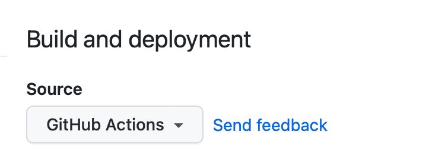
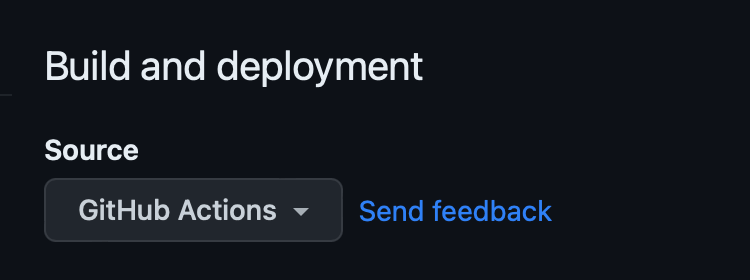

> **NOTE:** 该教程还没有完成从 Jekyll 版本的迁移，请谨慎参考。
{ .prompt-warning }

## 创建站点仓库

创建站点仓库时，根据您的需求有两种选择：

### 选项1. 使用起始模板（推荐）

这种方法简化了升级过程，隔离了不必要的文件，非常适合那些想专注于写作而不需要太多配置的用户。

1. 登录GitHub并导航到[**起始模板**][starter]。
2. 点击<kbd>Use this template</kbd>按钮，然后选择<kbd>Create a new repository</kbd>。
3. 将新仓库命名为`<username>.github.io`，其中`username`替换为您的小写GitHub用户名。

### 选项2. 复刻主题

这种方法便于修改功能或UI设计，但在升级时会遇到挑战。除非您熟悉Jekyll并计划对此主题进行大量修改，否则不要尝试这种方法。

1. 登录GitHub。
2. [复刻主题仓库](https://github.com/cotes2020/jekyll-theme-chirpy/fork)。
3. 将新仓库命名为`<username>.github.io`，其中`username`替换为您的小写GitHub用户名。

## 设置环境

创建仓库后，是时候设置您的开发环境了。主要有两种方法：

### 使用开发容器（Windows系统推荐）

开发容器使用Docker提供隔离环境，这可以防止与您的系统冲突，并确保所有依赖项都在容器内管理。

**步骤**:

1. 安装Docker：
   - 在Windows/macOS上，安装[Docker Desktop][docker-desktop]。
   - 在Linux上，安装[Docker Engine][docker-engine]。
2. 安装[VS Code][vscode]和[Dev Containers扩展][dev-containers]。
3. 克隆您的仓库：
   - 对于Docker Desktop：启动VS Code并[在容器卷中克隆您的仓库][dc-clone-in-vol]。
   - 对于Docker Engine：在本地克隆您的仓库，然后通过VS Code[在容器中打开它][dc-open-in-container]。
4. 等待开发容器设置完成。

### 本地设置（类Unix操作系统推荐）

对于类Unix系统，您可以本地设置环境以获得最佳性能，不过您也可以使用开发容器作为替代方案。

**步骤**:

1. 按照[Jekyll安装指南](https://jekyllrb.com/docs/installation/)安装Jekyll，并确保已安装[Git](https://git-scm.com/)。
2. 将您的仓库克隆到本地机器。
3. 如果您复刻了主题，安装[Node.js][nodejs]并在根目录中运行`bash tools/init.sh`来初始化仓库。
4. 在仓库根目录中运行命令`bundle`来安装依赖项。

## 使用方法

### 启动Jekyll服务器

要在本地运行站点，请使用以下命令：

```terminal
$ bundle exec jekyll serve
```

> 如果您使用的是开发容器，必须在**VS Code**终端中运行该命令。
{: .prompt-info }

几秒钟后，本地服务器将在<http://127.0.0.1:4000>上可用。

### 配置

根据需要更新`_config.yml`{: .filepath}中的变量。一些典型选项包括：

- `url`
- `avatar`
- `timezone`
- `lang`

### 社交联系选项

社交联系选项显示在侧边栏底部。您可以在`_data/contact.yml`{: .filepath}文件中启用或禁用特定联系方式。

### 自定义样式表

要自定义样式表，请将主题的`assets/css/jekyll-theme-chirpy.scss`{: .filepath}文件复制到Jekyll站点的相同路径中，并在文件末尾添加您的自定义样式。

### 自定义静态资源

静态资源配置在版本`5.1.0`中引入。静态资源的CDN在`_data/origin/cors.yml`{: .filepath}中定义。您可以根据您的网站发布地区的网络状况替换其中一些。

如果您更喜欢自托管静态资源，请参考[_chirpy-static-assets_](https://github.com/cotes2020/chirpy-static-assets#readme)仓库。

## 部署

部署前，检查`_config.yml`{: .filepath}文件并确保正确配置了`url`。如果您更喜欢[**项目站点**](https://help.github.com/en/github/working-with-github-pages/about-github-pages#types-of-github-pages-sites)且不使用自定义域名，或者您想通过GitHub Pages以外的Web服务器上的基本URL访问您的网站，请记得将`baseurl`设置为项目名称，以斜杠开头，例如`/project-name`。

现在您可以选择以下方法之一来部署您的Jekyll站点。

### 使用Github Actions部署

准备以下内容：

- 如果您使用的是GitHub免费计划，请保持站点仓库公开。
- 如果您已将`Gemfile.lock`{: .filepath}提交到仓库，并且您的本地机器不是运行Linux，请更新锁定文件的平台列表：

  ```console
  $ bundle lock --add-platform x86_64-linux
  ```

接下来，配置_Pages_服务：

1. 在GitHub上进入您的仓库。选择_Settings_标签，然后点击左侧导航栏中的_Pages_。在**Source**部分（_Build and deployment_下），从下拉菜单中选择[**GitHub Actions**][pages-workflow-src]。
   

{ .light .border .normal width="375" height="140" }


{ .dark .normal width="375" height="140" }

2. 将任何提交推送到GitHub以触发_Actions_工作流。在仓库的_Actions_标签中，您应该看到正在运行的_Build and Deploy_工作流。一旦构建完成并成功，站点将自动部署。

现在您可以访问GitHub提供的URL来访问您的站点。

### 手动构建和部署

对于自托管服务器，您需要在本地机器上构建站点，然后将站点文件上传到服务器。

导航到源项目的根目录，并使用以下命令构建您的站点：

```console
$ JEKYLL_ENV=production bundle exec jekyll b
```

除非您指定了输出路径，否则生成的站点文件将放置在项目根目录的`_site`{: .filepath}文件夹中。将这些文件上传到您的目标服务器。

[nodejs]: https://nodejs.org/
[starter]: https://github.com/cotes2020/chirpy-starter
[pages-workflow-src]: https://docs.github.com/en/pages/getting-started-with-github-pages/configuring-a-publishing-source-for-your-github-pages-site#publishing-with-a-custom-github-actions-workflow
[docker-desktop]: https://www.docker.com/products/docker-desktop/
[docker-engine]: https://docs.docker.com/engine/install/
[vscode]: https://code.visualstudio.com/
[dev-containers]: https://marketplace.visualstudio.com/items?itemName=ms-vscode-remote.remote-containers
[dc-clone-in-vol]: https://code.visualstudio.com/docs/devcontainers/containers#_quick-start-open-a-git-repository-or-github-pr-in-an-isolated-container-volume
[dc-open-in-container]: https://code.visualstudio.com/docs/devcontainers/containers#_quick-start-open-an-existing-folder-in-a-container 