# Healthy Back and Neck Protocol
"Chronic Back Pain" is one of the major contributors to general chronic pain in adults according to numerous studies. When doctors label something as "chronic", what they're really saying is "I don't know what to do with you, so take these pills and please don't come back".  
Human lifestyle keep converging towards more sedentary behavior, and having no adequate answer whatsoever from our physicians, we should explore more Proactive and Preventative Health methods. This cannot be overlooked -- maintaining back and spine health proved to preserve a healthier and a better physiological and neurological function of the brain. We actually CAN solve strained neck, migraines, lower back pain and others. 

Let me share how I completely solved and eradicated my lower back and neck pains through a systemic approach.

## Where Does The Pain Come From?

The root causes of back and lower back pain are often found in our modern lifestyle:

**Sedentary behavior** is probably one of the worst of them. Evolution never intended for us humans to be sitting for hours on end, sometimes without even standing up for a minute. Fundamentally, sedentary lifestyle ruins our spines by causing something called 

the Office jobs, computers, watching TV for long periods of time, sitting at the dinner table, sitting at school or university, studying, long flights. We don't do gardening anymore, for example.

**Excessive screen time** -- We just can't stop looking at our phones and computers. One of the issues that arise is the prolonged stationary positioning of the neck and overall body. In other words, muscles and joints accumulate pain and uneasiness over time. We'll discuss what you should do to avoid it a bit later.

**Poor posture habits** -- We are unaware of our posture while sitting and standing. Mainly how we sit for long periods of time affects our overall back, lower back, and neck health.

**Lack of movement** -- We don't move as much as we used to. Once we sit at the table or on a chair, we rarely think about getting up -- not until we have to go to the bathroom, someone knocks at the door, or we have to go somewhere.

## The Comprehensive Solution

### 1. Osteopathy Process

Commit to 2-3 months of osteopathic treatment, with sessions at least once per month, ideally biweekly. This hands-on approach addresses structural imbalances and promotes natural healing. Osteopathy therapists are experts in assessing overall back and neck health -- and at the end of the day, if you pay for treatment, a natural consequence is you will care more. Also, osteopathy will expedite and give your body a headstart in an anyway life-long process of regaining your back health and maintaining it.

### 2. Daily Stretching Routine

Incorporate morning and evening stretching into your routine. Get comfortable with those satisfying "clicks" in your back. Even 10 minutes daily provides significant benefits, though you can extend to a full hour for maximum results.

### 3. Therapeutic Yoga Poses

  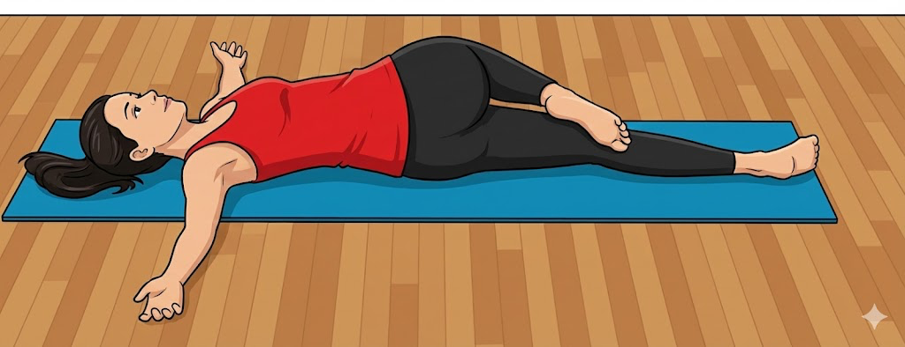
  <strong>Reclining Spinal Twist</strong>
  Promotes flexibility and releases stress

  

    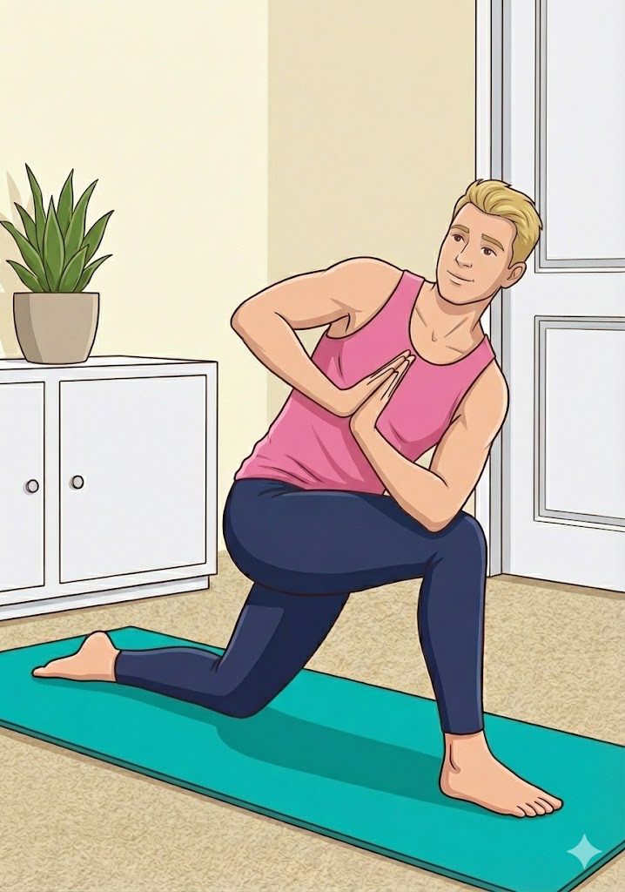
    <strong>Half Prayer Twist Pose</strong>
    Mobilizes the spine and relieves tension
  

  

    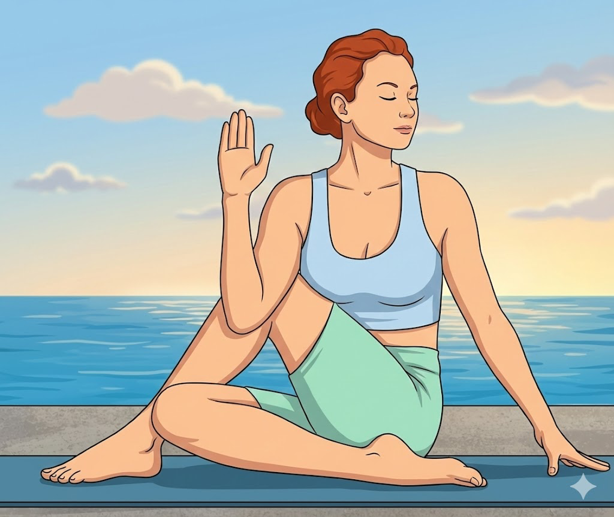
    <strong>Seated Spinal Twist</strong>
    Accessible seated variation for daily practice
  

  

    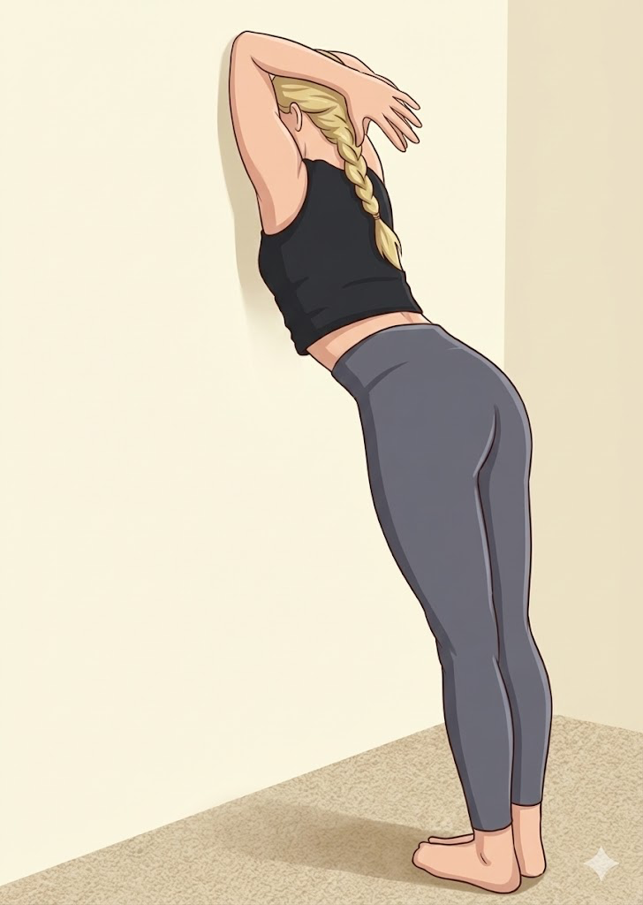
    <strong>Wall Neck Stretch</strong>
    Hold against a wall for one minute for immediate neck relief
  

  

    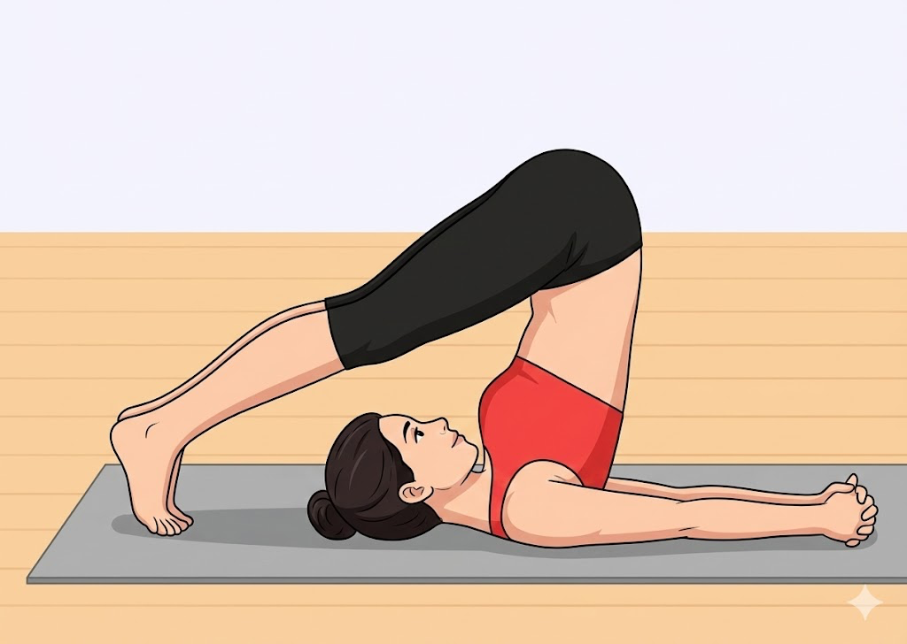
    <strong>Plow Pose (Halasana)</strong>
    Decompresses the spine and promotes circulation
  

### 4. Movement Integration

If your lifestyle is predominantly sedentary, set a 20-minute timer to remind yourself to get up and move. Regular movement breaks are essential for spinal health.

## Strengthening Your Back System

Building strength is crucial for long-term spinal resilience:

  

    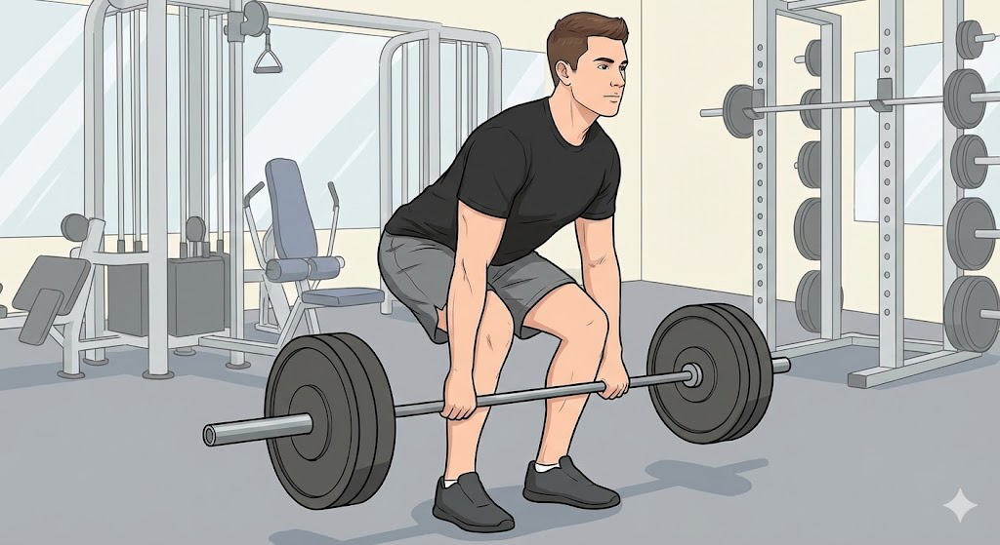
    <strong>Deadlift</strong>
    One of the best exercises for lower back and spinal stability
  

  

    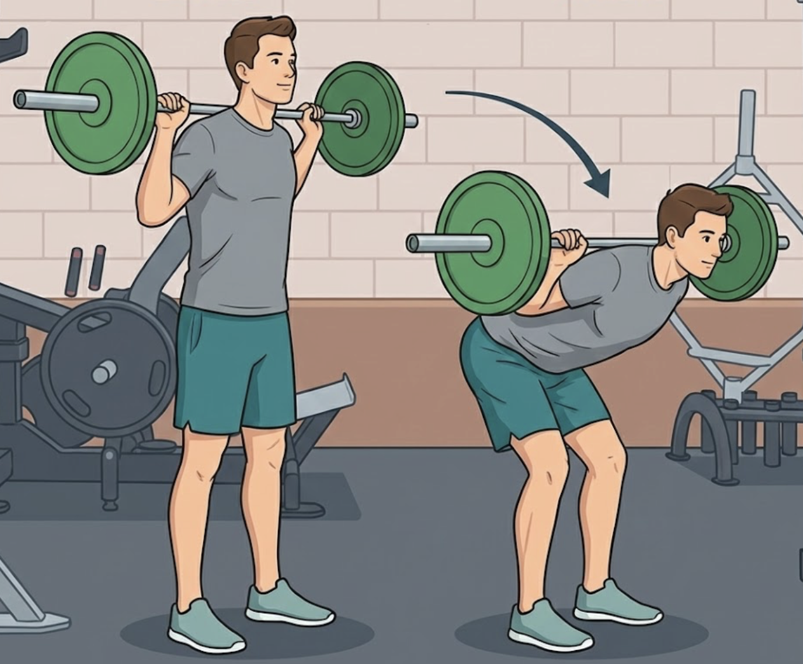
    <strong>Good Mornings</strong>
    Light to medium weight for posterior chain strength
  

  

    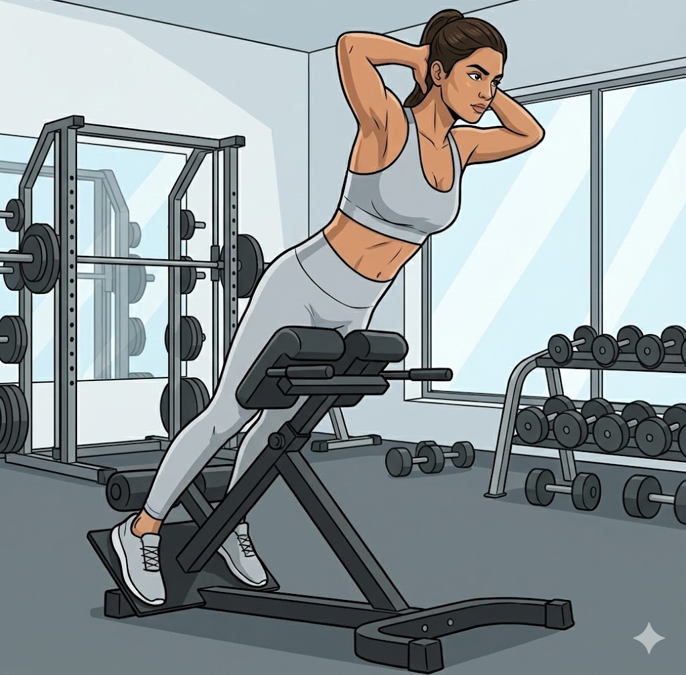
    <strong>Spinal Erector Work</strong>
    Back extension bench or floor-based exercises for deep back muscles
  

  

    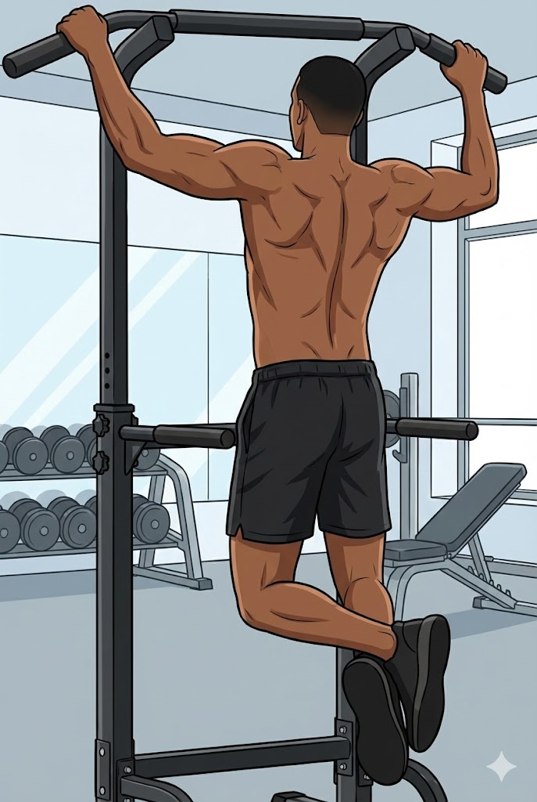
    <strong>Pull-ups</strong>
    Natural spinal decompression through hanging
  

## Ergonomic Investments

Consider these long-term investments in your spinal health:

  

    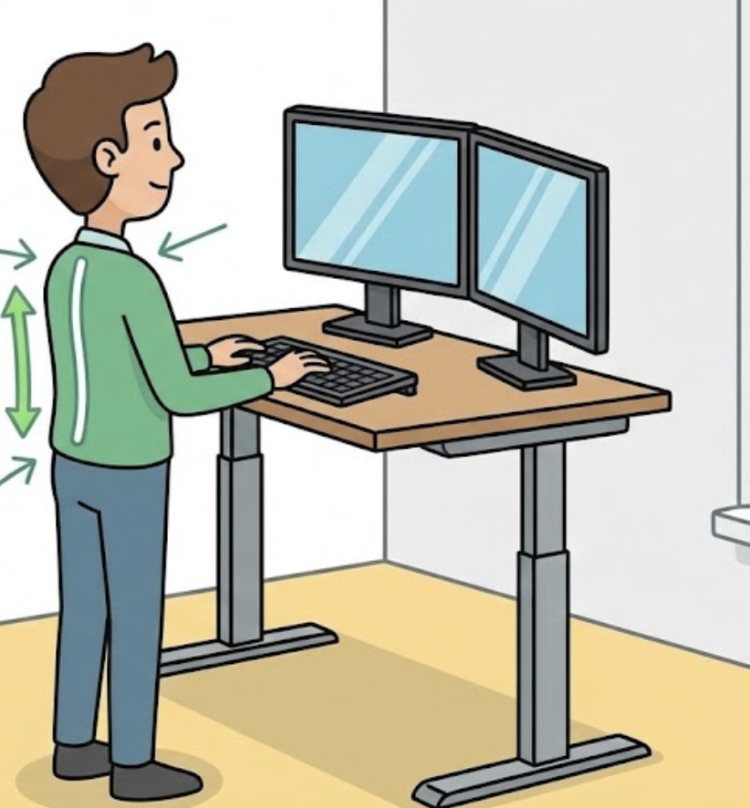
    <strong>Standing Desk</strong>
    Alternate between sitting and standing throughout the day
  

  

    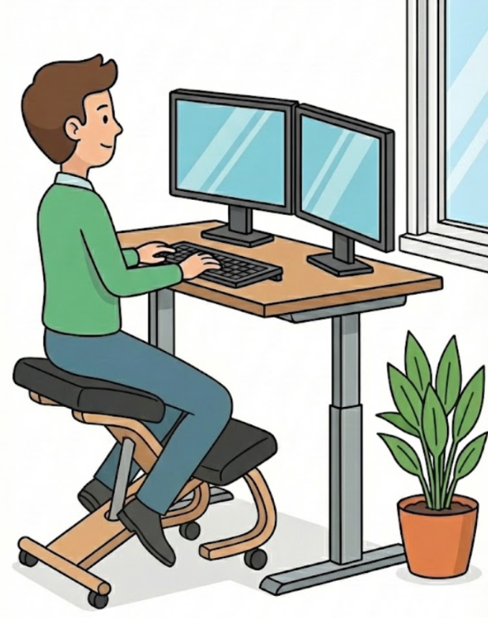
    <strong>Ergonomic Kneeling Chair</strong>
    Promotes active posture and reduces lower back strain
  

## The Systemic Mindset

Treating your back as a system rather than a problem means understanding that every component -- from posture and movement patterns to strength and flexibility -- works together. Small, consistent changes compound over time to create lasting health.

Remember: your back is a dynamic system that responds to how you treat it. Give it the care, movement, and strength training it needs, and it will serve you well for decades to come.
